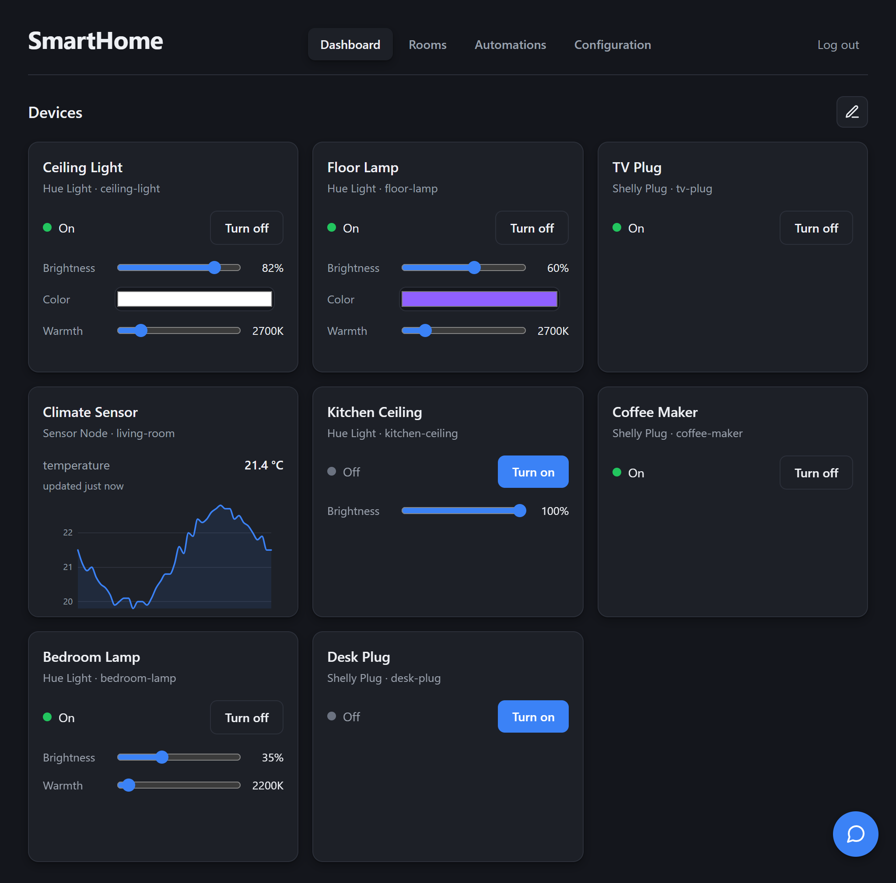
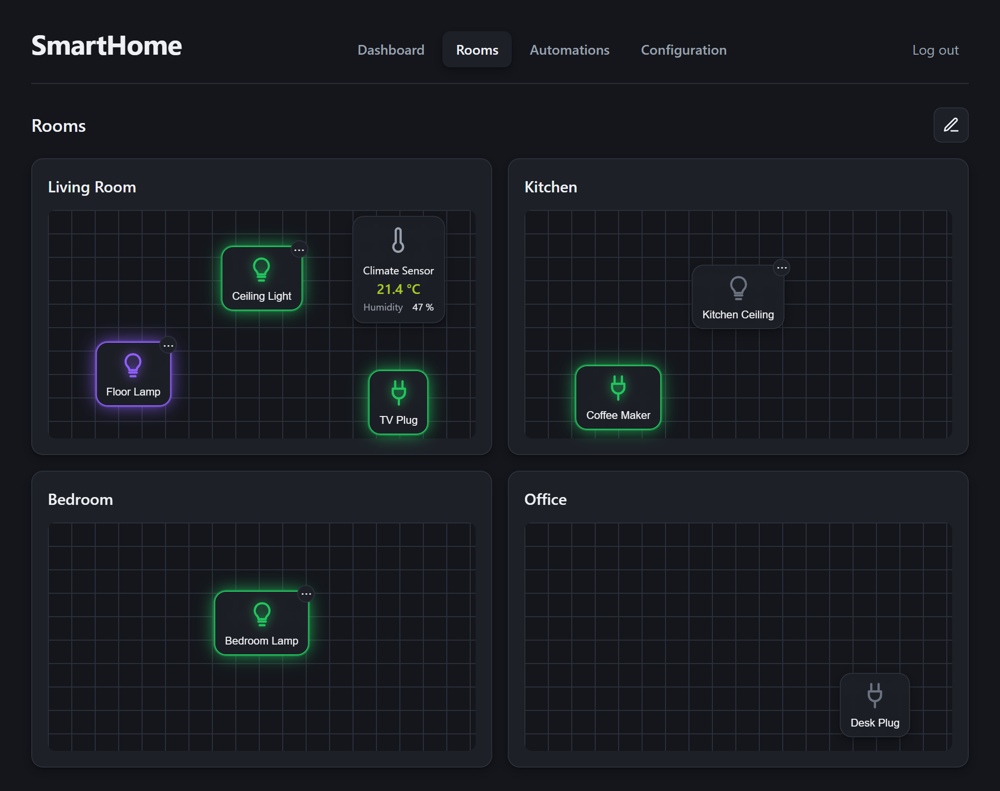

# SmartHome

A self-hosted smart-home hub: one dashboard for devices from different ecosystems, on your own hardware.

SmartHome brings devices from different ecosystems into one web dashboard, running on your own hardware as a single jar. No vendor apps and no required cloud account, so your devices and their data stay on your home network.

## Features

- **One dashboard across ecosystems.** Every device on a layout you arrange and the hub remembers.
- **Rooms and floors.** Group your devices on a floor plan.
- **Automations.** Act on sensor thresholds and schedules.
- **AI assistant.** Query and control your home in plain language, with your own Anthropic key.
- **Sensor history.** Chart each sensor's readings over time.
- **Self-hosted and extensible.** One jar on your hardware, and a new ecosystem is one adapter.

## Supported devices

- **Philips Hue** lights, through a bridge: on/off, brightness, color, and color temperature.
- **Shelly** plugs: on/off, with power metering.
- **Homematic** devices, through a CCU: switches and dimmers, plus climate and contact sensors.
- **Solakon** solar inverters: power and energy readings over Modbus.
- **MQTT sensor nodes**: temperature, humidity, pressure, CO2, and air quality.

## Documentation

The user guide and architecture docs are published at [felixgeisler.github.io/SmartHome](https://felixgeisler.github.io/SmartHome/). The [user guide](https://felixgeisler.github.io/SmartHome/guide/) covers building and running the hub, adding devices, and setting up rooms, automations, and the assistant.
